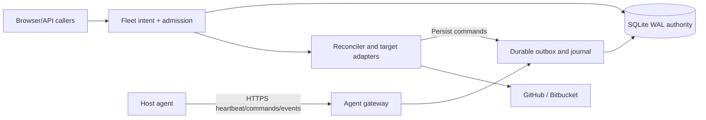

# Design

## Context

The existing control plane is a Rust 2024/Tokio/Axum service using SQLx and
SQLite WAL. Manager and reconciler paths can provision Docker/Tart resources,
the Tart agent can run native macOS runners, and the browser is React/Vite with
TanStack Router and Tailwind. Provider fields and provider-specific reservations
are currently the scheduling boundary; there is no durable host identity or
shared physical budget. API and reconciler provisioning also have separate side
effect paths. See `proposal.md` for the outcome and the capability specs in this
change for observable behavior.

SQLite remains the sole durable authority for one installation. A physical host
may expose several backends, and a backend may represent Docker, a Tart VM, or a
native process runtime. A remote engine is never mislabeled as local: its
physical host must be enrolled. GitHub and Bitbucket remain responsible for
assigning matching upstream jobs; GridOps places eligible runner capacity.

## Goals / Non-Goals

**Goals:**

- Model host, backend, target, workload, placement, command, epoch, and grant as
  distinct typed concepts with durable lifecycle and provenance.
- Provide one protocol and one admission path for API, autoscaling, and fix-agent
  demand across Linux, macOS, and Windows, including supported Bitbucket modes.
- Preserve existing pool associations, runner IDs, credentials, logs, jobs, and
  history while making uncertain state visible and safe to recover.
- Make trust, native/session capability, lifecycle state, and resource accounting
  explicit; produce evidence that separates local checks from real platform proof.

**Non-Goals:**

- In-flight upstream job migration, arbitrary remote shell/desktop control, OS
  installation, VPN/NAT setup, native-process isolation guarantees, or cloud VM
  creation.
- Active-active controllers, a broker/Kubernetes rewrite, a second scheduler, or
  automatic takeover of another controller's runners.
- Advertising an upstream runtime, architecture, or Bitbucket lifecycle mode
  before its artifact and execution behavior are observed.

## Decisions

### 1. Domain and persistence boundary

The implementation adds a `gridops-core::fleet` application service. It owns
validated domain values, eligibility, lifecycle transitions, and the atomic
intent transaction. API handlers and the reconciler call this service; manual
provision, autoscaling, and fix-agent requests cannot create a parallel path.
The reconciler owns upstream provider side effects and durable execution intents;
the host agent owns local runtime side effects. The agent gateway only
authenticates and exchanges persisted data.

| Entity | Durable responsibility | Required relationships and invariants |
| --- | --- | --- |
| `fleet_hosts` | Physical host identity, OS/arch, agent, epoch, enrollment, lifecycle, boot/session, budget revision | UUID is stable; reported hardware is a deduplication signal; old generations are revoked before replacement |
| `host_backends` | Discovered and enabled runtime capability, execution OS/arch, CI modes, probes, enforcement, session requirement | Belongs to one host; runtime kind is independent of CI target and host OS; readiness is explicit |
| `host_resource_domains` | Physical root budget, bounded child engine/VM budget, mount identity and reserve | Every allocation charges each constrained ancestor exactly once; child samples are not added to inclusive physical samples |
| `pool_execution_profiles` | Target, runtime/OS/arch/session/isolation, image/release, labels, resource request, host selector | Pool max is global; profiles cannot exceed it; selectors require grants and hard capability matches |
| `workload_placements` | Immutable host/backend assignment, workload kind, generation, target/upstream identity, config snapshot | At most one nonterminal placement per generation; replacement gets a new generation |
| `capacity_allocations` | Reserved/committed/releasing/uncertain/released charge bound to placement, epoch and policy revision | Expiry permits start denial only; unknown runtime never releases capacity |
| `host_commands` + attempts | Durable outbox, idempotency key, envelope version, deadline, cursor and result | Same request replays its result; changed payload under same ID is rejected |
| `external_runner_observations` | Authorized upstream/local inventory and provenance | Observation is never a managed object or permission to mutate; host confidence is explicit |
| `host_samples`, `fleet_events`, credentials, adoptions | Time series, audit, credential generations, handover journal | History survives retirement, migration, and table rebuilds |

Use additive nullable references first. Legacy Docker/Tart values remain for
history and compatibility, but new scheduling reads normalized backend/profile
metadata. A guarded SQLite table rebuild is required where obsolete provider
checks or NOT NULL fields prevent new values; copy every column, index, trigger,
and foreign-key target and verify counts and integrity before commit.

### 2. Agent boundary and versioned protocol

`gridops-host-agent` has a portable protocol/supervisor core and OS modules. A
privileged runtime helper communicates through narrow local IPC; the network
component never accepts arbitrary commands. systemd, launchd, and SCM install
the machine service. A separate LaunchAgent or Windows interactive helper is
required for user-session work and carries no broader authority.

The agent connects outbound over validated HTTPS to a versioned Axum API. The
wire envelope includes `protocol_version`, `command_id`, `idempotency_key`,
`host_id`, `host_epoch`, `placement_id`, `generation`, `config_revision`,
`issued_at`, `deadline`, and a typed operation. Secret material is a sealed,
placement-scoped reference, never an audit payload. Supported protocol ranges
are negotiated during enrollment and every reconnect; an incompatible agent is
held in maintenance with an actionable upgrade reason.

The default timing and limits are fixed contracts: 15-second heartbeat; stale at
45 seconds; offline at 90 seconds; 25-second maximum command long poll; bounded
acknowledged event batches; resumable HTTPS log/artifact chunks; monotonic local
deadline measurement with server timestamps for authority. Payload, batch,
cursor, log-chunk, and spool quotas are configured bounded integers and return
stable limit errors. Browser SSE remains a separate one-way status stream with
event IDs and replay cursors.

Receipt is journaled before acknowledgment or non-repeatable work. Results are
durably persisted before acknowledgment and replayed after reconnect. Commands
are at-least-once; adapter operations converge by deterministic target labels
and names, without claiming exactly-once execution across provider boundaries.

### 2a. API and wire contract

The initial fleet agent protocol is version `1`. Browser API JSON uses camelCase;
agent wire JSON uses snake_case. Both use UUID resource identifiers, integer
revisions/generations/epochs and RFC3339 timestamps. Browser mutations retain
same-origin protection and use an `Idempotency-Key` header. Edits/actions include
`expectedRevision`; a stale revision returns 409. Agent identity comes from its
credential and authenticated session, not a caller-supplied host ID. Returned
projections and placement rejections contain only information the principal may
read.

| Method and route | Authentication and behavior |
| --- | --- |
| `GET /api/v1/hosts`, `/api/v1/hosts/{id}` | Authorized host or target reader; filtered fleet/detail views |
| `GET /api/v1/hosts/{id}/backends`, `/samples`, `/events`, `/runners` | Same host-scoped authorization; bounded cursor pagination |
| `PATCH /api/v1/hosts/{id}` | System admin; idempotency key and expected revision; policy edit operation |
| `POST /api/v1/hosts/{id}/actions` | System admin or explicit scoped lifecycle authority; typed action and expected revision |
| `POST /api/v1/host-enrollments`, `POST /api/v1/host-enrollments/{id}/revoke`, `POST /api/v1/host-enrollments/{id}/approve` | System admin; scoped issuance, revocation or capability approval |
| `POST /api/v1/agent/enroll` | Single-use enrollment code supplied through protected input, not an already-issued host credential |
| `POST /api/v1/agent/handshake`, `POST /api/v1/agent/heartbeat` | Host credential; negotiate protocol and establish/renew authority session |
| `GET /api/v1/agent/commands?after={cursor}` | Host credential plus current session; long poll returning commands for that host only |
| `POST /api/v1/agent/commands/{id}/results`, `POST /api/v1/agent/events` | Same credential/session; durable result/event batches and acknowledgments |
| `POST /api/v1/agent/logs`, `POST /api/v1/agent/artifacts` | Same credential/session; placement-scoped offset/checksummed chunks |
| `POST /api/v1/agent/bootstrap/{reference}/claim` | Same host/session and exact command/placement generation; bootstrap material only |
| `POST /api/v1/agent/credentials/rotate-ack` | Rotating host credential; durable acknowledgment of the new generation |
| `GET /api/v1/external-runners`, `POST /api/v1/adoptions` | Authorized observations; mutation requires both fleet and CI-target permissions, which one person may hold |
| `GET /api/v1/operations/{id}`, `GET /api/v1/fleet/events` | Underlying resource permission; durable status and SSE replay |
| Existing pool/profile/eligibility-preview/runner/job/fix routes | Existing target/pool authorization plus host grant; mutations create fleet intents |

An action request and its asynchronous response are separate contracts. Example:
`POST /api/v1/hosts/11111111-1111-4111-8111-111111111111/actions`, with an
`Idempotency-Key` header and JSON body:

```json
{"action":"drain","expectedRevision":19}
```

HTTP 202 response:

```json
{
  "operationId":"22222222-2222-4222-8222-222222222222",
  "status":"accepted",
  "statusUrl":"/api/v1/operations/22222222-2222-4222-8222-222222222222"
}
```

A queued placement is a successful durable result, not an HTTP error:

```json
{
  "placementId":"33333333-3333-4333-8333-333333333333",
  "status":"queued",
  "explanation":{"selected":null,"rejections":[{"hostId":"11111111-1111-4111-8111-111111111111","reason":"stale_health"}]},
  "operationUrl":"/api/v1/operations/22222222-2222-4222-8222-222222222222"
}
```

A genuine revision conflict uses this HTTP 409 error shape:

```json
{
  "code":"revision_conflict",
  "message":"Host policy changed; reload before retrying.",
  "requestId":"44444444-4444-4444-8444-444444444444",
  "details":{"currentRevision":20}
}
```

Agent command example (all references below are synthetic, not credentials):

```json
{
  "protocol_version":1,
  "command_id":"55555555-5555-4555-8555-555555555555",
  "idempotency_key":"66666666-6666-4666-8666-666666666666",
  "host_id":"11111111-1111-4111-8111-111111111111",
  "host_epoch":12,
  "control_plane_incarnation":"77777777-7777-4777-8777-777777777777",
  "authority_session_id":"88888888-8888-4888-8888-888888888888",
  "backend_id":"99999999-9999-4999-8999-999999999999",
  "placement_id":"33333333-3333-4333-8333-333333333333",
  "generation":4,
  "config_revision":19,
  "issued_at":"2026-10-09T10:00:00Z",
  "deadline":"2026-10-09T10:01:00Z",
  "operation":{
    "kind":"start_runner",
    "prepared_environment_id":"aaaaaaaa-aaaa-4aaa-8aaa-aaaaaaaaaaaa",
    "execution_profile_id":"bbbbbbbb-bbbb-4bbb-8bbb-bbbbbbbbbbbb",
    "bootstrap_reference":"cccccccc-cccc-4ccc-8ccc-cccccccccccc",
    "allocation_id":"dddddddd-dddd-4ddd-8ddd-dddddddddddd",
    "resource_request":{"cpu_millis":500,"memory_mib":1024,"disk_mib":4096}
  }
}
```

A result repeats command, host/epoch, incarnation/session, backend, placement and
generation identity; for the command above its result fields include:

```json
{
  "command_id":"55555555-5555-4555-8555-555555555555",
  "host_id":"11111111-1111-4111-8111-111111111111",
  "host_epoch":12,
  "control_plane_incarnation":"77777777-7777-4777-8777-777777777777",
  "authority_session_id":"88888888-8888-4888-8888-888888888888",
  "backend_id":"99999999-9999-4999-8999-999999999999",
  "placement_id":"33333333-3333-4333-8333-333333333333",
  "generation":4,
  "state":"succeeded",
  "local_resource_id":"runner-local-01",
  "observed_at":"2026-10-09T10:00:08Z"
}
```

Every operation is a discriminated union. `prepare_environment` carries a profile
revision, image/release identity and allocation; `start_runner` references that
prepared environment and scoped bootstrap; `inspect`, `drain`, `stop` and
`cleanup` name the owned placement/generation and expected runtime identity.
`upgrade_agent` references a signed manifest/version and drained operation.
`execute_sandbox`, sandbox file and artifact operations name an owned fix-sandbox
placement plus bounded command/timeout or relative path/offset/checksum; they
cannot address a host shell or another workload. The complete profile and
resource snapshot is immutable once dispatched and resolves under the exact
configuration revision in the command. Results include a typed success, bounded
failure or uncertain outcome and the matching runtime identity.

Defaults are configurable within enforced hard caps: enrollment code TTL 10
minutes (1–60 minutes, single-use), autoapproval policy TTL at most 1 hour and
limited to named hosts/targets/capabilities, credential rotation overlap 5
minutes or until new-generation acknowledgment, heartbeat 15 seconds, stale 45
seconds, offline 90 seconds, local authority TTL 90 seconds renewed only by an
authenticated server response, and a 60-second start grant issued only after
preparation and upstream bootstrap are ready. Image preparation has a separate
20-minute deadline (hard maximum 60 minutes) and cannot launch a runner without
a fresh Start command. JSON requests default to 1 MiB (hard 2 MiB), event
batches to 100 items/256 KiB, log/artifact chunks to 256 KiB, pending commands
to 100 per host (hard 1,000), and local log spool to 256 MiB (hard 2 GiB).
Reserve control slots so lifecycle/fencing is not starved by data work. Cursor
retention is 30 days, idempotency results at least 24 hours, and durable
nonterminal operation keys remain until terminal plus 24 hours. An individual operation retries with exponential full-jitter backoff from
1 second to 30 seconds, capped at 10 attempts before a durable retryable-failure
state. Connectivity reconnect continues at the capped rate while the service is
enabled; a long outage does not permanently strand the host. Expired bootstrap references are deleted/invalidated and require a fresh
attempt; they are never replayed. Limits return stable errors and are measured
separately from upstream latency. Journal-full pauses starts and reports health;
log-spool-full truncates only with dropped-byte offsets/cursor gaps. The command
and event journal never discards unacknowledged state transitions to make room
for logs, and per-host concurrency bounds keep a noisy agent from dominating
SQLite writes.

New asynchronous mutations return HTTP 202 and an operation URL. A replay with
the same actor, resource, idempotency key, and canonical payload returns the
same operation; changed payload or expected revision returns 409. Bad agent
credentials return 401, a missing scope returns 403, an expired enrollment,
grant, or cursor returns 410 with an authorized safe reason, a size violation
returns 413, rate limiting returns 429, and dependency/readiness failure returns
503. No compatible host is a durable queued result with its explanation, not a
generic error. Error JSON is `{code,message,requestId,details}`, with details
filtered by authorization. IDs are UUIDs, revisions/generations/epochs are
integers, wall timestamps are RFC3339, expiries use local monotonic durations,
and cursors are opaque authenticated values. Pagination defaults to 25 and is
bounded at 100. A bootstrap claim is scoped to one host/session/command/generation and may
serve only that identity until journaled receipt is acknowledged or the claim
expires. Retries of the same claim before acknowledgment return the same sealed
material; they never mint another upstream registration. After acknowledgment or
expiry the material cannot be fetched again. Loss after acknowledgment requires
local-journal recovery or an explicit reconciled fresh registration attempt.
This separates one authorized execution from unreliable HTTP delivery. Bootstrap
material is separate from command/audit JSON and never appears in logs.

Authority and start expiry use suspend-aware monotonic elapsed time. If the
operating system cannot account for suspend, a sleep/resume event invalidates
authority and requires a fresh authenticated handshake and inventory before any
new Start. Wall-clock jumps cannot extend authority. A replay after expiry first
checks journaled object identity and never creates a new object under an expired
grant. The agent must durably record acceptance and begin the authorized local start
before the start grant expires; a lost network acknowledgment does not erase
that evidence. Starting is bounded by the earlier of grant, bootstrap and local
authority expiry. Renewal is rate-limited and requires a successful authenticated
server response. A response received after its originating authenticated request
has timed out cannot extend authority. Detect clock uncertainty and require a
fresh handshake rather than extending a deadline.



### 3. Placement, fairness, and shared admission

Eligibility filters hard constraints first: target authorization, profile,
runtime/OS/architecture, image/release, trust, session availability, lifecycle,
fresh health, and resource bounds. The explanation includes every rejected
host/backend and a stable error code. Among eligible candidates, placement
balances normalized reserved plus committed CPU/memory, then image readiness,
configured preference, and stable host ID. It never rebalances a live placement.

In one short write transaction the service rechecks epoch, lifecycle,
permissions, pool/profile revision and aggregate allocations; creates placement,
root/child allocations, and command intent atomically. No provider HTTP call is
inside that transaction. SQLite write serialization and uniqueness constraints,
not an in-process mutex, prevent duplicate admission. Scheduling uses equal-weight
round-robin across eligible pools, round-robin across profiles within each pool,
and oldest eligible demand within each profile. Each pool receives at most one
successful admission per logical round; adding profiles does not buy extra pool
share. Non-fitting/incompatible head requests are skipped with a recorded reason
so they cannot block other eligible requests. Enqueue age and sequence are
retained without introducing a second weighting algorithm.

Each scheduling slice examines at most 100 queued intents, then persists its
pool/profile cursor and logical-round progress before continuing. A logical round
may span slices; it is not reset after each 100-item batch. Restart resumes that
cursor. Manual demand joins the same queues. Fairness guarantees each eligible
pool a scheduling opportunity per completed logical round when a request fits;
it does not promise wall-clock start time without compatible capacity, or
preemption of existing jobs. Placement among eligible backends compares normalized
committed-plus-reserved utilization, image readiness, configured preference,
then stable host ID and backend ID. Deterministic ties never move live workloads.

CPU uses fixed units and memory/disk use integer MiB/bytes. Docker runners,
Tart VMs, native processes, and fix sandboxes all charge the same physical root;
Docker/VM child budgets additionally constrain their own domain. Unknown pressure
blocks only the affected host; unknown placements continue to count against
host and pool maxima. macOS native limits are reservations unless enforcement
is proven; Linux cgroups and Windows Job Objects are reported as enforcement
capabilities rather than assumed from platform labels.

### 4. Lifecycle, fencing, and unknown outcomes

Enrollment, connectivity, scheduling intent, integrity, and backend health are
separate axes. A host epoch and boot/session identity fence ownership. Replacing
or recovering a host revokes the old credential generation, advances the epoch,
and requires inventory reconciliation before readiness. A stale epoch cannot
mutate current placement, allocation, or command state.

Placement transitions are `pending -> reserved -> registering -> starting ->
running -> draining/stopping -> stopped -> cleaned`, with explicit retryable,
terminal, and uncertain branches. Command transitions are
`pending -> delivered -> accepted -> running -> succeeded/failed`. Missing
heartbeats, timeouts, failed listings, or lost acknowledgments are not proof of
termination. Ambiguous registrations are recovered by target-scoped lookup and
unique operation names; Bitbucket secret loss creates a visible cleanup and
fresh-registration path rather than a blind retry.

When authority expires, the agent rejects new starts and quiesces idle managed
listeners. Busy work can finish and logs spool within quota. If an adapter cannot
prove idle quiescence, it remains blocked/unknown and retains capacity until an
explicit disruptive action. Cleanup tombstones remain until both local and
upstream removal are confirmed. Restore starts paused with a new control-plane
incarnation, invalidates restored credentials/pending starts, and requires
host-by-host re-handshake.

### 5. Trust and authorization

Enrollment codes are short-lived, single-use, host-scoped, and constrained to
named target/pool scopes. Credentials are high-entropy opaque values stored with
OS ACL/keychain protection; the server stores a hash. Rotation has an acknowledged
overlap; revocation rejects future requests and queued starts. Browser same-origin
and CSRF protections remain, while agent authentication cannot call browser admin
routes.

System administrators manage enrollment, global budgets, trust, native/session
enablement, and host lifecycle. Installation/pool administrators choose only
within grants. Bitbucket workspace authorization is independent of GitHub
installation access. Members receive only permitted workload data; hardware and
cross-target utilization require administrator or explicit host-reader grants.
Capability-bearing authorization proofs are checked again in the admission write
transaction. Native and interactive execution requires explicit trusted target,
least-privilege account, session readiness, and declared isolation limits.

### 6. Backend matrix and adapter rationale

Backend capability records, not OS labels, drive this normative baseline matrix.
Every row is a committed release row; missing hardware or provider evidence
leaves the row pending and blocks full acceptance rather than converting it to
unsupported. The only baseline exclusion below is a genuinely upstream-
unsupported Bitbucket Windows ARM64 target.

| Backend | GitHub Actions | Bitbucket Pipelines | Enforcement/session rule |
| --- | --- | --- | --- |
| Linux Docker x64/ARM64 | ephemeral and persistent where upstream supports | Linux Docker adapter with upstream Docker prerequisites | cgroups/daemon trust and child budget required |
| Linux native shell x64/ARM64 | ephemeral and persistent where upstream supports | Linux Shell where upstream supports | trusted target; shared kernel/account disclosed |
| macOS native x64/ARM64 | native runner | native Shell where upstream supports | launchd plus TCC/session readiness; reservations unless proven |
| macOS Tart VM on Apple Silicon | existing ephemeral GitHub VM runners | persistent macOS Shell in VM | child VM budget; current Tart behaviors preserved |
| Windows native x64 headless | headless service | PowerShell adapter with verified prerequisites | SCM service, non-admin account, Job Objects |
| Windows native x64 interactive | explicit authorized user-session mode | PowerShell/session mode where verified | interactive helper; Session 0 is ineligible |
| Windows native ARM64 headless | currently available GitHub ARM64 artifact | excluded only where Bitbucket is genuinely upstream-unsupported | GitHub support status and execution evidence are separate |
| Windows native ARM64 interactive | currently available GitHub ARM64 artifact where session helper supports it | excluded only where Bitbucket is genuinely upstream-unsupported | authorized user session; evidence required |

Bitbucket registrations remain persistent unless an upstream lifecycle contract
is proven. GitHub JIT/registration and Bitbucket registration stay in the
control-plane adapter; only minimum bootstrap material crosses to the host.
Docker Desktop/WSL is a Linux backend attached to its physical host, never a
Windows/macOS execution label. Planned baseline rows cannot be removed merely
because they are untested; they remain pending until evidence closes them.
Unsupported combinations return explicit errors.

### 7. Migration, release, and proof strategy

Migration order is backup/restore rehearsal, schema/domain tables, verified
existing endpoint mapping, agent enrollment and inventory, adapter reconciliation,
then fleet scheduling. Existing active runners are retained. Unverified Docker/
Tart physical mapping blocks new placements and is shown as legacy/unassigned.
Supported launchers refuse obsolete provider-only deployments against mixed
fleet state; cutover also removes their execution access as described below. Rollback is allowed before incompatible rows/operations;
after cutover, use forward repair or a drained, verified conversion/restore.

The guarded migration sequence pauses all writers and executors that may mutate
the database, verifies a consistent backup, runs `PRAGMA foreign_keys=OFF`
outside a transaction, then opens `BEGIN IMMEDIATE` (or an exclusive maintenance
transaction), creates exact replacement definitions, copies every record, drops
and renames in safe replacement order, restores indexes/triggers, and checks row
counts, relationships, foreign keys, and integrity before commit. It commits,
enables `foreign_keys=ON`, and rechecks integrity. A precommit mismatch rolls
back the transaction. A postcommit verification failure keeps services stopped
and invokes the verified backup/repair procedure; it cannot roll back an already
committed transaction. The special runner sits outside SQLx's automatic per-file
transaction, and its SQLx migration version/checksum marker is committed atomically with the
schema replacement so restart cannot replay an already-committed rebuild.

At cutover, stop legacy API/reconciler/manager/Tart instances, revoke old
execution credentials, and remove obsolete direct Docker/agent access paths.
Supported launcher/upgrade tooling gates schema and protocol versions and refuses
rollback after incompatible cutover; a manually started pre-fleet binary cannot
be expected to detect new readiness metadata. New host agents reject obsolete
authority/auth/protocol. A local administrator manually granting old Docker root
access is outside the enforceable protocol boundary.

Agent artifacts are signed per OS/architecture with checksums and protocol range.
Canary and bounded-concurrency rollout drain by default, stage atomically, retain
the prior binary/journal, verify inventory, and roll back only when journal/schema
compatibility permits. Otherwise the host remains maintenance with recovery data.

Proof is reported in separate ledgers: unit/property/concurrency and migration
checks; local CI and coverage; real Linux/macOS/Windows host and session runs;
real GitHub/Bitbucket jobs and registration cleanup; LAN/VPN/NAT/proxy/TLS;
browser accessibility/responsive states; and fault/restore/adoption/upgrade
evidence. Windows service installation/build is not execution proof, and a
document-only Bitbucket or TCC assertion cannot close the gate. The required
first-party line coverage target is at least 95% per changed crate/package,
without using coverage as a substitute for platform behavior.

The release load gate (F32) uses 100 connected hosts and 1,000 managed runner
records, 15-second heartbeats, command polls held for no more than 25 seconds,
and ten concurrent 64 KiB/s log streams for 30 minutes. It runs the real API,
SQLite, journal, and log paths on a documented local control-plane test host with
4 vCPUs, 8 GiB RAM, and local SSD. Fleet/detail reads must remain below 1 second
p95, eligible commands must become available to connected pollers within 5
seconds p95, and resident memory must stay below 6 GiB without a post-warmup
growth trend. Record database/log growth and retention cleanup. This is a
release acceptance workload and is not runtime proof that all records execute
concurrently.

## Risks / Trade-offs

- [SQLite single-writer contention] -> Keep admission transactions short, use
  integer constraints and bounded queues, and measure write latency under mixed
  API/autoscaler/fix-agent load.
- [Native jobs mutate a shared host] -> Require administrator trust grants,
  disclose the boundary, isolate directories/process trees, and avoid sandbox
  claims where the OS cannot enforce them.
- [Upstream drain semantics differ] -> Adapter contracts must prove quiescence;
  otherwise retain unknown capacity and require explicit disruption.
- [Physical identity cannot be inferred from endpoints] -> Require verified
  enrollment/inventory mapping and hold affected new placements.
- [Offline controllers can outlive revocation] -> Epochs and deadlines fence
  future commands only; retain unknown allocations and surface the limitation.
- [Windows hardware, Bitbucket artifacts, and macOS TCC may be unavailable in CI]
  -> Keep platform-specific evidence pending and block completion rather than
  silently narrowing the release.

## Migration Plan

1. Back up the current database and rehearse restore with a fresh control-plane
   incarnation; verify counts, foreign keys, event history, and rollback gates.
2. Add normalized host/backend/profile/placement/allocation/command/event tables
   and nullable legacy links. Run the guarded provider compatibility rebuild only
   after an exclusive writer pause and integrity verification.
3. Inventory and explicitly map existing Docker/Tart endpoints; enroll their
   hosts, retain running resources, and expose unresolved mappings as legacy.
4. Install and canary host agents, reconcile local/upstream inventory, then enable
   one authority path and fleet placement behind readiness checks.
5. Roll out adapters, UI, adoption, lifecycle, and fix-agent routing by host;
   enable GitHub and each proven Bitbucket target/profile independently.
6. If a pre-cutover rollback is required, drain and stop new fleet operations,
   restore or convert only after ownership accounting, and use supported launcher gates plus revoked execution access to prevent
   obsolete deployments from mutating mixed fleet resources. Post-cutover recovery is forward repair or a
   verified restore with re-handshake.

## Open Questions

- Which physical machines are available for the Windows headless and interactive
  runs, and which macOS sessions can grant required TCC permissions? This affects
  evidence scheduling, not the contract or implementation boundary.
- Which Bitbucket runner architecture/version and queue diagnostics are available
  on each target? Adapters must publish observed support or return unsupported.
- What exact graceful-drain semantics do each supported persistent runner expose?
  The adapter may remain blocked/unknown until a real proof closes this gate.
